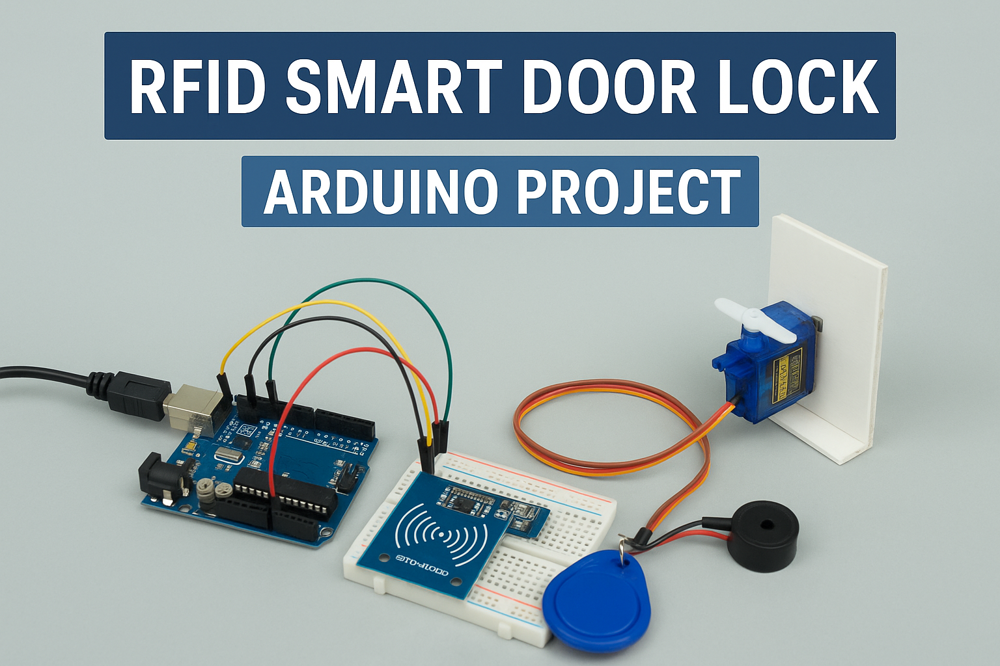

# RFID-Door-Lock

An IoT-based RFID Smart Door Lock System using Arduino, RFID reader, Servo motor, and Buzzer.
# 🔐 RFID-Based Smart Door Lock System

## 📌 Project Overview
This project demonstrates an **IoT + Embedded Systems based RFID Smart Door Lock System** that ensures secure access using RFID cards/tags.  
It uses an **RFID reader**, **servo motor**, and **buzzer** to control access in real-time.

- ✔️ **Authorized Card:** Door unlocks for 3 seconds + short beep (0.5s)  
- 🚫 **Unauthorized Card:** 3-second warning beep  

This project is an excellent example of building **practical access control solutions** using Arduino.

---

## 🛠️ Components Used
- Arduino Uno    
- RFID Reader (MFRC522) + RFID Cards/Tags  
- Servo Motor (for door lock mechanism)  
- Buzzer  
- Jumper wires & Breadboard  
- Power Supply  

---

## ⚙️ Working Principle
1. User scans an RFID card using the reader.  
2. The system checks if the card ID matches the authorized list.  
3. If **authorized** → Servo rotates to unlock position for 3s + buzzer beeps shortly.  
4. If **unauthorized** → Servo stays locked + buzzer sounds for 3s as a warning.  

---

## 📂 Repository Contents
- `RFID_Door_Lock.ino` → [Main Arduino source code](RFID_Door_Lock.ino)  
- `circuit_diagram.png` → [Circuit Diagram](Media/Circuit%20Diagram.png) 
- `RFID-Door-Lock.mp4` → [Project video](Media/RFID-Door-Lock.mp4)

---

## 🚀 How to Run
1. Open the `.ino` file in Arduino IDE  
2. Install required libraries:  
   - `MFRC522.h`  
   - `SPI.h`  
   - `Servo.h`  
3. Upload the code to Arduino board  
4. Connect components as per circuit diagram  
5. Test the system with RFID cards  

---

## 📖 Learning Outcomes
- Embedded C & Arduino Programming  
- RFID authentication system design  
- Hardware interfacing (RFID, Servo, Buzzer)  
- Prototyping real-world IoT security systems  

---

## 🤝 Contributing
Have ideas to improve this project?  
Feel free to **fork this repo** and submit a pull request.  

---

## 📬 Contact
Created by **Toshak**  
- LinkedIn: https://www.linkedin.com/in/toshak-garg  
- GitHub: https://github.com/toshakgarg  

---

## 🏷️ Tags
`IoT` `Embedded Systems` `Arduino` `RFID` `Security System` `Project`
